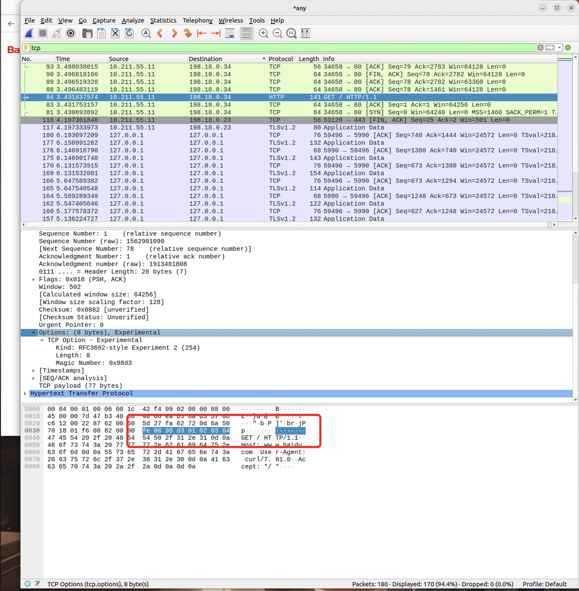

# FakeToaGo

最近在学eBPF，发现了BeiChen师傅之前写的FakeToa，学习一下拿Go写了一下用户态程序。理论上是修改成功的。

## eBPF Program

hook到`sockops`，关于`sockops`可以稍微参考一下[BPF 进阶笔记（五）：几种 TCP 相关的 BPF（sockops、struct_ops、header options）](https://arthurchiao.art/blog/bpf-advanced-notes-5-zh/#3-tcp-header-options)，但是里面提到的东西并不算多。可以再具体看一下[[PATCH v3 bpf-next 6/9] bpf: tcp: Allow bpf prog to write and parse TCP header option - Martin KaFai Lau](https://lore.kernel.org/bpf/20200730205736.3354304-1-kafai@fb.com/)


因此其实非常简单，就是给个flag是`BPF_SOCK_OPS_WRITE_HDR_OPT_CB_FLAG`然后在里面`bpf_store_hdr_opt(skops, &fakeToa, sizeof(fakeToa), 0);`就可以了。


## User Program

并没有考虑其他的cgroup，程序里写死了绑定到`/sys/fs/cgroup`。

```go
	cgroup, err := link.AttachCgroup(link.CgroupOptions{
		Path:    "/sys/fs/cgroup",
		Attach:  ebpf.AttachCGroupSockOps,
		Program: objs.BpfSockopsHandler,
	})
```

也没有直接将程序pin到文件系统，停止程序就意味着停止hook。别的没太多坑点。


## Example of Use

环境搭建参考Cilium的官方文档吧：[Getting Started - ebpf-go Documentation](https://ebpf-go.dev/guides/getting-started/)

我的Linux版本：

```bash
uname -a
Linux ubuntu-linux-22-04-02-desktop 6.5.13-060513-generic #202311281736 SMP PREEMPT_DYNAMIC Tue Nov 28 18:10:14 UTC 2023 aarch64 aarch64 aarch64 GNU/Linux
```

至少版本不能太低吧。而且要支持cgroup v2。

配置好之后需要自己修改`gen.go`里的配置，基本上改个架构应该就行。

运行：

```shell
go generate
go build -o main
./main -h
Usage of ./main:
  -ip string
        ip of Tcp Option Address that you want to fake (default "8.8.8.8")
  -opcode uint
        opcode of Tcp Option Address (default 254)
  -port uint
        port of Tcp Option Address (default 80)

go build -o main &&./main  -ip 1.2.3.4 -port 39123
```


wireshark抓包证明修改成功。



但是一直没找到能真正显示出这个TOA中ip的网站，找了很多都不支持。

## References

[BPF 进阶笔记（五）：几种 TCP 相关的 BPF（sockops、struct_ops、header options）](https://arthurchiao.art/blog/bpf-advanced-notes-5-zh/#3-tcp-header-options)

[[PATCH v3 bpf-next 6/9] bpf: tcp: Allow bpf prog to write and parse TCP header option - Martin KaFai Lau](https://lore.kernel.org/bpf/20200730205736.3354304-1-kafai@fb.com/)

[Getting Started - ebpf-go Documentation](https://ebpf-go.dev/guides/getting-started/)

[ChatGPT 指导下的 TOA 伪造之旅 丨](https://www.tr0y.wang/2023/12/13/fake_toa/)